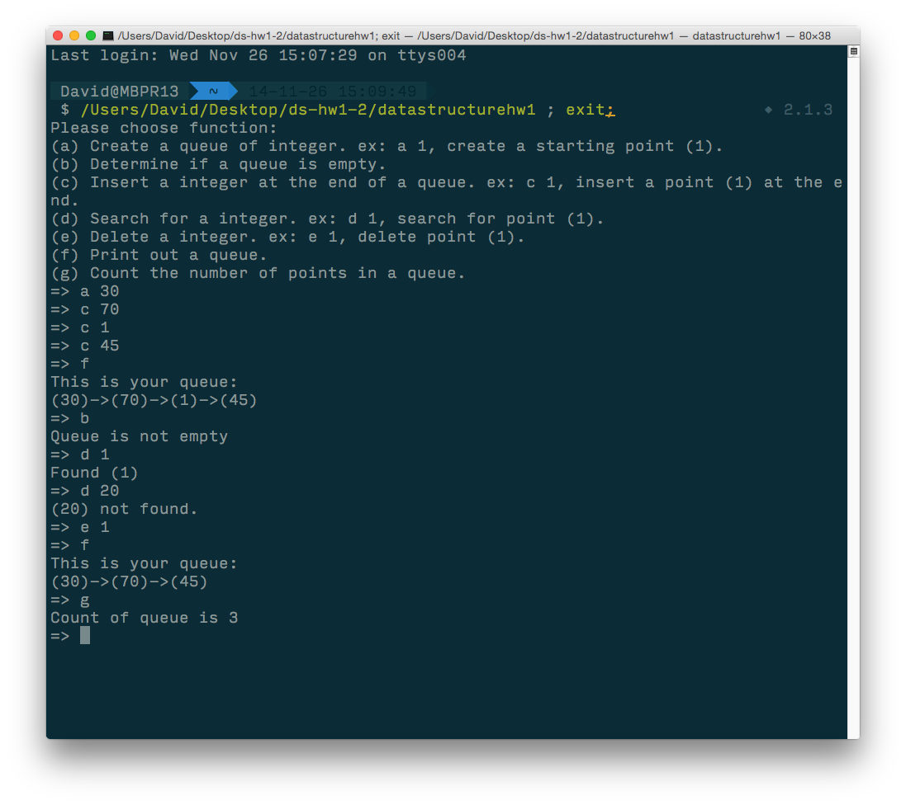

#Data Structure HW 1
##Linked list of two-dimensional points

##This is hw 1 of data structure.

###Question
For integer data sets, create a user-friendly, menu-driven program that implements a queue by a
linked list, including the following operations. Please discuss the complexity for each operation.
###requirment
(a) Create a queue of integers.

(b) Determine if a queue is empty.

(c) Insert an integer at the end of a list.

(d) Search for an integer.

(e) Delete an integer.

(f) Print out a queue.

(g) Count the number of points in a queue.

##Build
	gcc datastructurehw1.c -o datahw1
##Run
	./datahw1
##Instruction of each function 
	Please choose function:
	(a) Create a queue of integer. ex: a 1, create a starting point (1).
	(b) Determine if a queue is empty.
	(c) Insert a integer at the end of a queue. ex: c 1, insert a point (1) at the end.
	(d) Search for a integer. ex: d 1, search for point (1).
	(e) Delete a integer. ex: e 1, delete point (1).
	(f) Print out a queue.
	(g) Count the number of points in a queue.